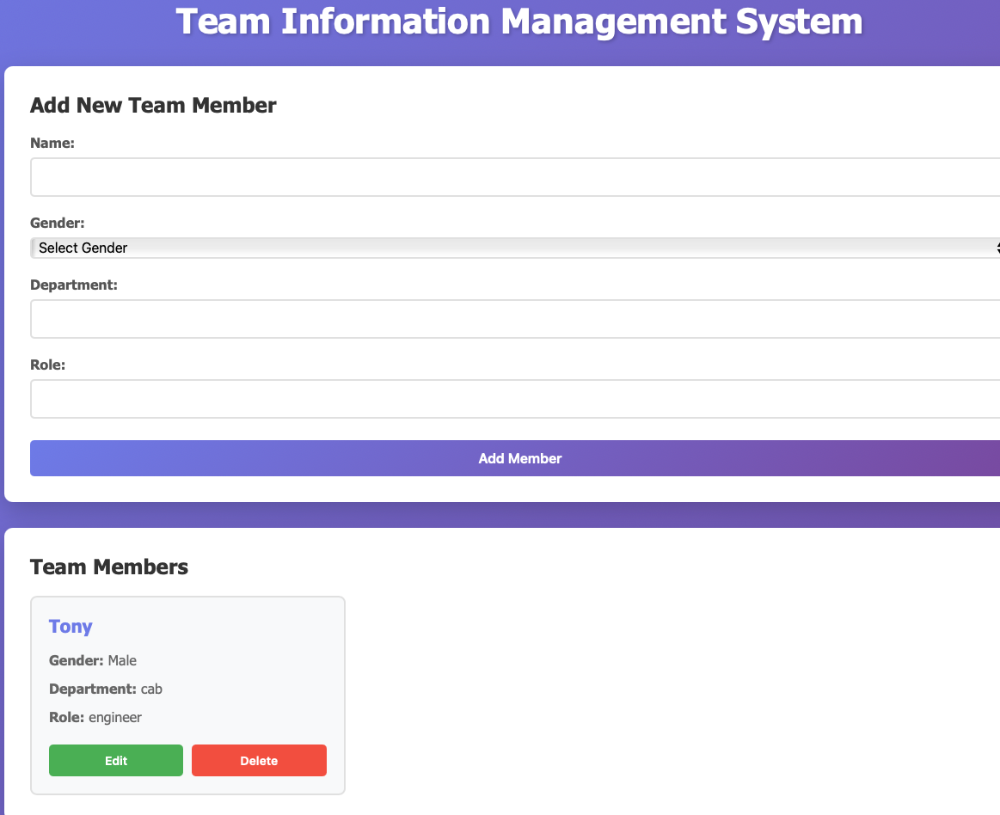

# Team Information Management System

A simple web-based team information management system with a Python Flask backend and HTML/CSS/JavaScript frontend.

## Features

- Add new team members with name, gender, department, and role
- View all team members in a clean card-based interface
- Edit existing team member information
- Delete team members
- SQLite database for persistent storage
- RESTful API architecture

## Project Structure

```
PythonPOC/
├── backend/
│   └── app.py          # Flask API server
├── frontend/
│   ├── index.html      # Main HTML page
│   ├── script.js       # JavaScript for API calls and UI
│   └── style.css       # Styling
├── requirements.txt    # Python dependencies
└── .gitignore
```

## Installation

1. Install Python dependencies:
```bash
pip install -r requirements.txt
```

## Running the Application

1. Start the backend server:
```bash
cd backend
python app.py
```
The API server will start on http://localhost:5000

2. Open the frontend:
```bash
# Simply open frontend/index.html in your web browser
# Or use a simple HTTP server:
cd frontend
python -m http.server 8000
```
Then visit http://localhost:8000 in your browser

## API Endpoints

- `GET /api/members` - Get all team members
- `GET /api/members/<id>` - Get a specific team member
- `POST /api/members` - Create a new team member
- `PUT /api/members/<id>` - Update a team member
- `DELETE /api/members/<id>` - Delete a team member

## Usage

1. Fill in the form fields (Name, Gender, Department, Role)
2. Click "Add Member" to create a new team member
3. View all team members in the cards below
4. Click "Edit" on any member card to update their information
5. Click "Delete" to remove a member (with confirmation)

## Technologies Used

- **Backend**: Python, Flask, SQLAlchemy, SQLite
- **Frontend**: HTML5, CSS3, JavaScript (Vanilla)
- **Database**: SQLite


